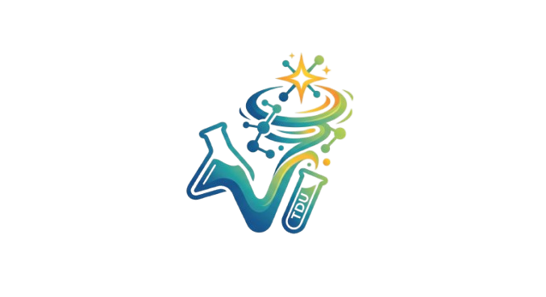
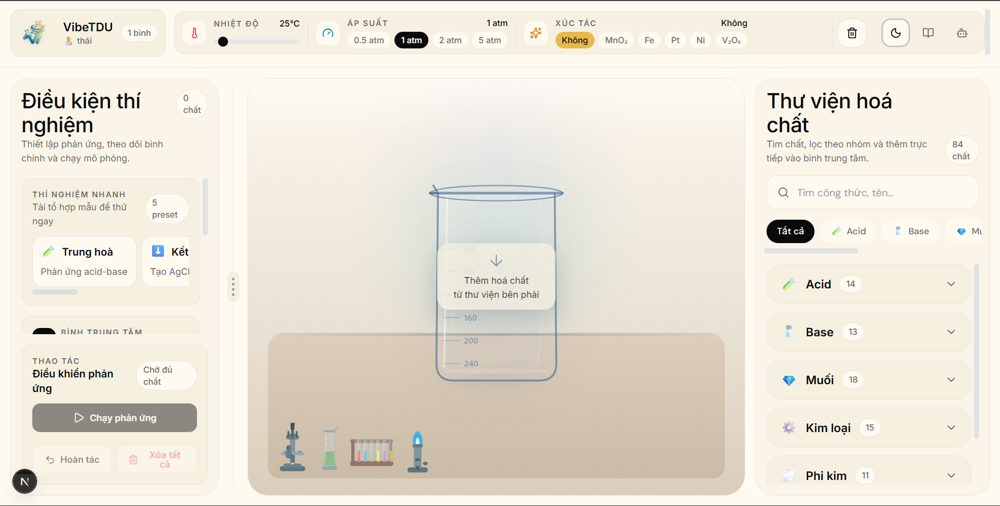

# <div align="center"></div>

# <div align="center" style="font-family: 'Copernicus', 'Times New Roman', serif; color: #cc785c; font-size: 2.5em; font-weight: bold; margin-top: 15px;">ChemLab — VibeTDU</div>

<div align="center" style="margin-top: 10px; margin-bottom: 25px; font-family: 'Inter', sans-serif;">
  <p style="font-size: 1.25em; color: #6c6a64; font-style: italic; margin-bottom: 15px;">Phòng thí nghiệm Hoá học ảo tương tác & an toàn thế hệ mới</p>

  <!-- Author Badges -->
  <div style="display: inline-block; padding: 10px; background-color: #faf9f5; border: 1px solid #e6dfd8; border-radius: 12px; box-shadow: 0 4px 12px rgba(20,20,19,0.04);">
    <span style="font-weight: 600; color: #141413; display: block; margin-bottom: 8px; font-size: 0.9em; text-transform: uppercase; letter-spacing: 1px;">👨‍💻 Nhóm Tác Giả</span>
    <a href="#" style="text-decoration: none;">
      
    </a>
    &nbsp;&nbsp;
    <a href="#" style="text-decoration: none;">
      
    </a>
  </div>
</div>

---

<div align="center" style="margin: 30px 0;">
  
  <p style="font-size: 0.9em; color: #8e8b82; margin-top: 10px; font-style: italic;">🎨 Giao diện thực tế trực quan và hiện đại của ứng dụng ChemLab (VibeTDU)</p>
</div>

---

## 🧪 Tổng Quan Về Dự Án

**ChemLab (VibeTDU)** là một nền tảng web mô phỏng **phòng thí nghiệm hóa học ảo tương tác** đột phá. Thiết kế dựa trên triết lý tối giản, ấm áp và mang hơi thở giáo dục hiện đại (Warm-Cream Aesthetic), dự án hướng tới việc cung cấp một không gian thực nghiệm ảo **tuyệt đối an toàn, trực quan sinh động và giàu tính sư phạm** cho học sinh, sinh viên và những người đam mê khoa học.

Thay vì tiếp cận hóa học qua những công thức khô khan trên sách vở, ChemLab cho phép người dùng trực tiếp kéo thả các hóa chất, tự do điều chỉnh các yếu tố môi trường (nhiệt độ, áp suất, chất xúc tác) và quan sát những phản ứng hóa học diễn ra ngay lập tức dưới dạng các hiệu ứng hình ảnh sống động. Hệ thống được tích hợp trí tuệ nhân tạo (AI Assistant) để tự động giải thích và hướng dẫn người dùng học tập sâu sắc hơn sau mỗi thí nghiệm.

---

## ⚡ Các Tính Năng Vượt Trội

Dự án sở hữu một loạt các tính năng cao cấp mang lại trải nghiệm tương tác chân thực nhất:

<table style="width: 100%; border-collapse: collapse; border: none; font-family: 'Inter', sans-serif;">
  <tr style="border: none;">
    <td style="width: 50%; padding: 15px; border: none; vertical-align: top;">
      <div style="background-color: #faf9f5; border: 1px solid #e6dfd8; border-radius: 12px; padding: 20px; height: 180px; box-shadow: 0 4px 10px rgba(0,0,0,0.02);">
        <h3 style="color: #cc785c; margin-top: 0; display: flex; align-items: center; gap: 8px;">
          🖱️ Không Gian Kéo - Thả
        </h3>
        <p style="font-size: 0.95em; color: #3d3d3a; line-height: 1.5;">
          Giao diện kéo-thả (sử dụng thư viện <code>@dnd-kit</code>) mượt mà giúp người dùng dễ dàng di chuyển các chai hóa chất từ tủ đựng vào cốc phản ứng trung tâm.
        </p>
      </div>
    </td>
    <td style="width: 50%; padding: 15px; border: none; vertical-align: top;">
      <div style="background-color: #faf9f5; border: 1px solid #e6dfd8; border-radius: 12px; padding: 20px; height: 180px; box-shadow: 0 4px 10px rgba(0,0,0,0.02);">
        <h3 style="color: #cc785c; margin-top: 0; display: flex; align-items: center; gap: 8px;">
          🌡️ Điều Khiển Môi Trường
        </h3>
        <p style="font-size: 0.95em; color: #3d3d3a; line-height: 1.5;">
          Bảng điều khiển động lực học cho phép thay đổi <b>nhiệt độ</b> (từ 0°C đến 100°C), <b>áp suất</b> (0.5 atm đến 5 atm) và tùy chọn các <b>chất xúc tác</b> (MnO₂, Fe, Pt, Ni, V₂O₅) để tác động trực tiếp lên tốc độ và kết quả phản ứng.
        </p>
      </div>
    </td>
  </tr>
  <tr style="border: none;">
    <td style="width: 50%; padding: 15px; border: none; vertical-align: top;">
      <div style="background-color: #faf9f5; border: 1px solid #e6dfd8; border-radius: 12px; padding: 20px; height: 180px; box-shadow: 0 4px 10px rgba(0,0,0,0.02);">
        <h3 style="color: #cc785c; margin-top: 0; display: flex; align-items: center; gap: 8px;">
          ✨ Mô Phỏng Trực Quan Đa Dạng
        </h3>
        <p style="font-size: 0.95em; color: #3d3d3a; line-height: 1.5;">
          Hệ thống hiệu ứng hình ảnh phức hợp tự động kích hoạt dựa trên kết quả phản ứng: sủi bọt khí (<code>GAS_BUBBLE</code>), kết tủa lắng đọng (<code>PRECIPITATE</code>), biến đổi màu sắc (<code>COLOR_CHANGE</code>), sinh nhiệt lượng hay hiệu ứng phát nổ (<code>EXPLOSION</code>).
        </p>
      </div>
    </td>
    <td style="width: 50%; padding: 15px; border: none; vertical-align: top;">
      <div style="background-color: #faf9f5; border: 1px solid #e6dfd8; border-radius: 12px; padding: 20px; height: 180px; box-shadow: 0 4px 10px rgba(0,0,0,0.02);">
        <h3 style="color: #cc785c; margin-top: 0; display: flex; align-items: center; gap: 8px;">
          🤖 Trợ Lý Hoá Học AI
        </h3>
        <p style="font-size: 0.95em; color: #3d3d3a; line-height: 1.5;">
          Tích hợp mô hình AI <b>Google Gemini</b> thông minh, cung cấp tính năng chat đa nhiệm và giải thích phản ứng hóa học bằng tiếng Việt chi tiết với <b>3 cấp độ học tập</b> tùy biến (Cơ bản, Trung cấp, Chuyên sâu).
        </p>
      </div>
    </td>
  </tr>
  <tr style="border: none;">
    <td style="width: 50%; padding: 15px; border: none; vertical-align: top;">
      <div style="background-color: #faf9f5; border: 1px solid #e6dfd8; border-radius: 12px; padding: 20px; height: 180px; box-shadow: 0 4px 10px rgba(0,0,0,0.02);">
        <h3 style="color: #cc785c; margin-top: 0; display: flex; align-items: center; gap: 8px;">
          📚 Thư Viện 84+ Hoá Chất
        </h3>
        <p style="font-size: 0.95em; color: #3d3d3a; line-height: 1.5;">
          Phân loại khoa học các hóa chất theo nhóm: Axit, Bazơ, Muối, Kim loại, Phi kim... Tích hợp bộ tìm kiếm và bộ lọc trực quan giúp nhanh chóng tìm ra công thức cần thiết.
        </p>
      </div>
    </td>
    <td style="width: 50%; padding: 15px; border: none; vertical-align: top;">
      <div style="background-color: #faf9f5; border: 1px solid #e6dfd8; border-radius: 12px; padding: 20px; height: 180px; box-shadow: 0 4px 10px rgba(0,0,0,0.02);">
        <h3 style="color: #cc785c; margin-top: 0; display: flex; align-items: center; gap: 8px;">
          🌐 Tra Cứu Hoá Chất Phân Tầng
        </h3>
        <p style="font-size: 0.95em; color: #3d3d3a; line-height: 1.5;">
          Hệ thống backend tự động định danh hóa chất chưa có sẵn thông qua chuỗi fallback API toàn cầu thông minh: Local Cache → PubChem → Cactus → OPSIN → AI dịch thuật.
        </p>
      </div>
    </td>
  </tr>
</table>

---

## 🛠️ Công Nghệ Sử Dụng

Hệ thống được phát triển dựa trên kiến trúc phân tầng độc lập cực kỳ bền vững:

### 🎨 Frontend Ecosystem
- **Framework:** Next.js 15 (React 19) & TypeScript mang lại hiệu suất tối đa.
- **Styling:** Tailwind CSS v4 kết hợp hiệu ứng chuyển động mượt mà của `Framer Motion` và `tw-animate-css`.
- **State Management:** Zustand hỗ trợ đồng bộ trạng thái cực nhanh, phục vụ tính năng **Undo/Redo** và lưu giữ nhật ký phản ứng.
- **Drag & Drop:** `@dnd-kit` mang lại trải nghiệm tương tác tự nhiên.

### ⚙️ Backend Ecosystem
- **Framework:** Spring Boot 3 (Java 17) mạnh mẽ và bảo mật cao.
- **Database:** H2 Database (cho môi trường phát triển) và PostgreSQL (cho môi trường production) tối ưu truy vấn registry hóa chất.
- **External Connections:** Tích hợp các cổng kết nối API hóa chất PubChem, NCI/Cactus, OPSIN.
- **AI Integration:** Google Gemini AI WebClient dự đoán phản ứng tự động và tương tác chatbot.
- **API Documentation:** Tích hợp Swagger UI / SpringDoc OpenAPI để lập tài liệu API rõ ràng.

---

> [!TIP]
> ### 💡 Chế độ Hoạt động Ngoại tuyến (Offline Mock Mode)
> Nếu bạn không muốn cài đặt và chạy máy chủ Backend, ChemLab hỗ trợ một chế độ **Offline Mode** hoàn hảo qua file cấu hình `src/utils/reaction-mock.ts`. Ứng dụng vẫn có thể giả lập mượt mà các phản ứng phổ biến và hiển thị đầy đủ hiệu ứng trực quan mà không cần kết nối mạng!

---

## 🚀 Hướng Dẫn Khởi Chạy Nhanh

Thực hiện theo các bước sau để thiết lập dự án ngay trên máy tính của bạn:

### 1. Chuẩn bị môi trường
Yêu cầu hệ thống đã cài đặt sẵn:
- **Node.js** >= 20
- **Java JDK** >= 17 (dành cho Backend)
- **Maven** (nếu muốn chạy thủ công các task backend)

### 2. Khởi chạy Frontend
```bash
# Di chuyển vào thư mục frontend
cd frontend

# Sao chép tệp cấu hình môi trường
cp .env.example .env.local

# Cài đặt các thư viện phụ thuộc
npm install

# Khởi chạy server phát triển
npm run dev
```
👉 Truy cập giao diện tại: **[http://localhost:3000](http://localhost:3000)**

### 3. Khởi chạy Backend
```bash
# Di chuyển vào thư mục backend
cd backend

# Khởi chạy Spring Boot thông qua Maven wrapper
./mvnw spring-boot:run
```
👉 Cổng API mặc định: **`http://localhost:8080`**  
👉 Tra cứu tài liệu Swagger UI tại: **`http://localhost:8080/swagger-ui.html`**

---

<div align="center" style="margin-top: 30px; padding: 20px; background-color: #181715; border-radius: 12px; color: #faf9f5;">
  <span style="color: #cc785c; font-size: 1.4em; font-weight: bold; display: block; margin-bottom: 8px;">🌟 ChemLab — VibeTDU 🌟</span>
  <p style="font-size: 0.9em; max-width: 600px; margin: 0 auto; color: #a09d96;">
    Chúng tôi hy vọng dự án này sẽ mang lại niềm cảm hứng học tập hóa học mới mẻ cho tất cả mọi người thông qua sự kết hợp của công nghệ hiện đại và thiết kế tối giản, tinh tế.
  </p>
</div>
